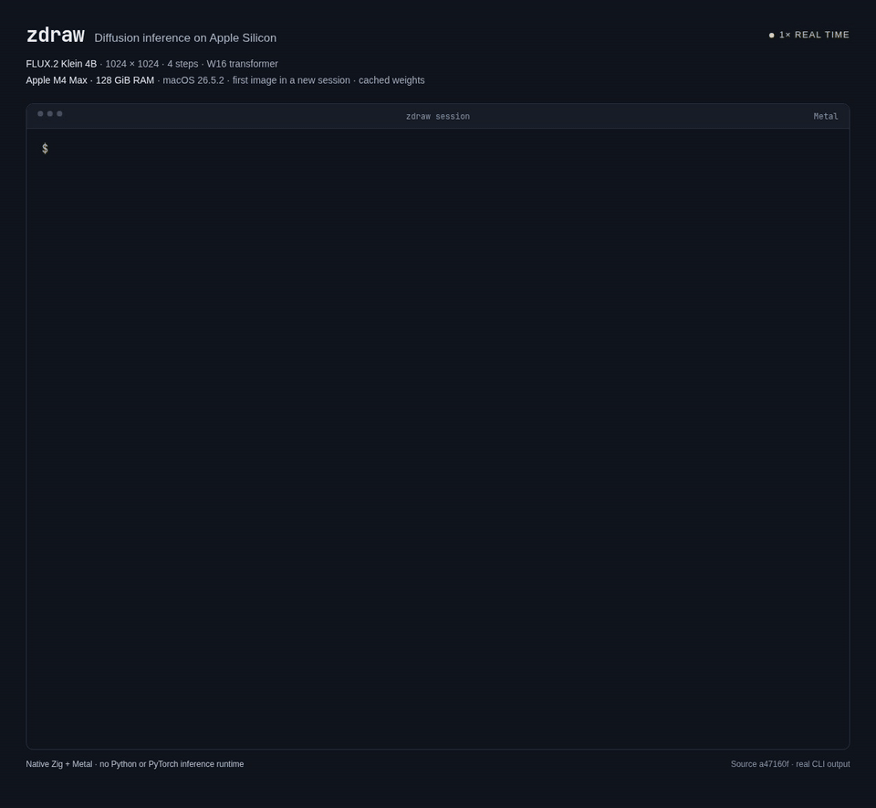

<picture>
  <source media="(prefers-color-scheme: dark)" srcset="assets/wordmark-dark.svg">
  
</picture>

A Zig/Metal inference engine for diffusion models on Apple Silicon: one small
binary with its own Metal kernels, no Python, PyTorch or model server. It runs
two open-weight text-to-image models locally, **FLUX.2 Klein 4B** (distilled
and base) and **Z-Image-Turbo**, for generation and editing.

[](assets/demo/klein-cli.mp4)

*1024×1024, four steps, M4 Max / 128 GiB, cached weights. Playback at 1×.
[Full reroll/save demo](docs/demo.md).*

zDraw exists for two properties most engines do not offer. Renders are
deterministic: the same request produces the same bytes, so an image can be
reproduced from its recipe, a benchmark card from another Mac is comparable
with yours, and a kernel change is judged by a hash rather than by eye. Memory
is treated as a budget rather than a side effect: weights stay memory-mapped
and activations live in reused pools, so a 1024×1024 Klein render adds about
3 GiB of process memory on top of the weight file and the engine can share a
Mac with other work.

- Generate from text, edit a photo by instruction, redraw a masked region,
  vary an image with `--init-image --strength`, or render several seeds at once.
- Klein 4B in four steps, its undistilled base checkpoint in 50 guided steps,
  and Z-Image-Turbo with a `product` or bit-exact `strict` decoder profile.
- Watch Klein's approximate previews as it samples, then see the decoded image.
- Keep models loaded in a session; reroll, undo, switch models and save results.
  [Stanza](https://github.com/gmontana/stanza) provides terminal history and completion.
- PNGs from `generate` and `bench` carry a recipe chunk: model, prompt hash,
  seed, size, steps and guidance.
- Resumable downloads, W16 packing with optional W6/W4 quantisation and LoRA
  merging, and a prompt and image safety filter. `zdraw doctor` reports the
  routes your Mac will use; `zdraw bench` renders the certified case.

## What is in the repository

- `src/`: the engine, one folder per owner: `metal/` (kernels, contexts and
  the Objective-C bridge), `klein/` and `zimage/` (the two model families),
  `sampling/`, `vae/`, `text/` (the Qwen3 encoder and tokenizer), `pack/`
  (weight files and sidecars), `runtime/` (model state, profiles, metrics),
  `cli/` (commands, sessions, terminal previews, safety) and `control/`
  (experimental execution controls). `main.zig` is the CLI root, `lib.zig`
  the package the tools import, `tests.zig` the test root.
- `cmd/`: one file per tool executable: the pack builders (`kleinpack`,
  `zpackbuild`) and the kernel benchmarks and gates; `zig build check`
  compiles them all.
- `certified/hashes.json`: the reference hashes that `zdraw bench` checks.
- `docs/`: usage, features, architecture, the measurement protocol, the
  validation record and the resolution report with its evidence.
- `tools/`, `vendor/`, `safety/`, `community/`: the quality and benchmark
  harnesses, the vendored Metal attention kernels (MLX steel and MFA, MIT),
  the prompt rules, and the table of benchmark cards from other Macs.

Model weights are not included; `zdraw fetch` downloads and packs them (Klein
about 24 GB on disk, Z-Image about 49 GB). There is no desktop app or SDK in
this repository.

## Quick start

You need an Apple Silicon Mac with [Zig 0.16.0](https://ziglang.org/download/)
and Xcode's Metal compiler. Everything below was validated on an M4 Max with
128 GiB running macOS 26; other Apple Silicon Macs build and pass the
weight-free tests in CI, but their generation speed, memory and output are
unvalidated.

```sh
xcrun metal --version
zig build
./zig-out/bin/zdraw fetch flux2-klein-4b
./zig-out/bin/zdraw generate --model flux2-klein-4b \
  --prompt "a red fox in deep snow" --show --out fox.png
```

[Usage and troubleshooting](docs/usage.md) · [Supported features](docs/features.md) ·
[How it works](docs/how-it-works.md), a short tour of the model and the implementation

## Speed and memory

1024×1024, four steps, W16 weights, **M4 Max / 128 GiB**, measured 5 October 2026:

| Model | End-to-end time | Peak RSS | Peak footprint |
| --- | ---: | ---: | ---: |
| FLUX.2 Klein 4B | 11.96 s | 2.33 GiB | 3.02 GiB |
| Z-Image-Turbo | 24.52 s | 3.95 GiB | 4.72 GiB |

Median of three fresh processes with cached weights, including loading through
PNG saving. Memory is the maximum measured across those runs, **not minimum Mac
RAM**: mapped weight pages can occupy additional memory.
[All tested resolutions, image samples and methods](docs/resolutions.md).

## Editing

“Add a blue wool scarf around the fox's neck”:

| Before | After |
| --- | --- |
|  |  |

[Run this edit](docs/demo.md#editing-example). Instruction edits can change other
areas; masks give spatial control with a feathered boundary.

## Contributing

Bug fixes, documentation and results from other Macs are welcome: run
`zdraw bench` and submit the card to the
[community benchmark table](community/RESULTS.md).
See [CONTRIBUTING.md](CONTRIBUTING.md) for setup and tests.

## Licence

[Apache-2.0](LICENSE), including [commercial use](COMMERCIAL.md).
Third-party code is listed in [NOTICE](NOTICE); model weights retain their
upstream licences.
